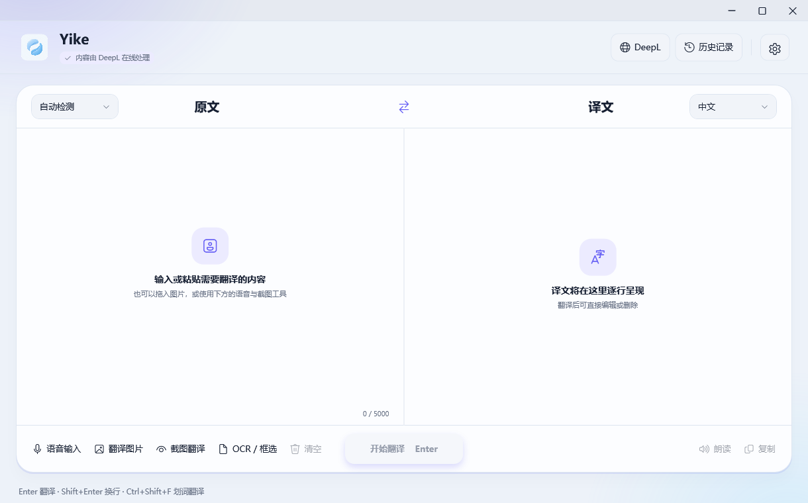
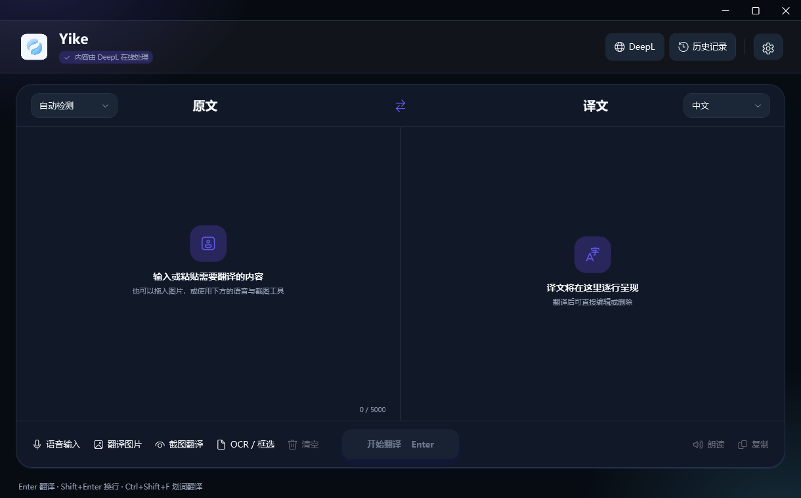

# Yike · Windows 桌面翻译

Yike 是一款基于 C#、WPF 和 DeepL API 的 Windows 桌面翻译工具，将文本翻译、划词翻译、图片 OCR 和语音功能放在同一个窗口中。

本仓库为 Windows x64 版本。设置中已移除“账号与安全”页面，翻译使用你自己的 DeepL API 密钥。



<details>
<summary>查看深色界面</summary>



</details>

## 功能

- 文本翻译：自动检测原文语言，支持中文、英文、日文、韩文等选项，保留多行与空行布局。
- 划词翻译：选中文字后按 `Ctrl + Shift + F`，在独立浮窗中查看译文。
- 图片与截图：导入图片、截图、框选 OCR 区域，查看识别内容和图片译文。
- 语音输入：通过本机 Whisper 识别麦克风输入，支持在输入框长按空格启动。
- 朗读：提供在线自然语音和 Windows 本机语音。
- 历史记录：保存文本和图片历史，支持收藏与删除。
- 外观：浅色、深色和跟随系统主题，支持界面缩放、托盘和单实例运行。
- 更新：从 GitHub 检查 Windows 稳定版，核对安装包大小和 SHA-256 后下载并安装，支持取消。

## 环境要求

- Windows 10 2004 / Windows 11，x64。
- .NET Framework 4.8；源码构建使用其自带的 C# 编译器。
- 翻译需要网络及有效的 [DeepL API 密钥](https://www.deepl.com/your-account/keys)。本项目不附带共享密钥，API 额度与费用以服务提供方为准。
- OCR 需要安装相应 Windows 语言的 OCR 功能；语音输入需要麦克风权限与 Whisper 运行库。

## 安装与使用

下载 [Yike Windows 1.2.3 完整安装包](https://github.com/a17746168234-alt/Yike/releases/tag/windows-v1.2.3) 中的 `Yike-Setup.exe`，运行后安装到当前用户目录，无需管理员权限。完整安装包包含语音运行库；GitHub Actions 的核心构建产物用于开发与检查。

1.2.3 修复应用内更新检查与版本一致性，权限页可检测真实组件状态，并修复设置跳转和窗口按钮行为；包含之前的划词小窗关闭按钮、语音输入和朗读优化。详细变更见 [CHANGELOG.md](CHANGELOG.md)。

安装包旁的 `SHA256SUMS.txt` 可用于校验下载内容。

1. 打开 Yike，点击顶部 **DeepL** 按钮。
2. 输入自己的 API 密钥并保存；程序根据密钥选择 API Free / Pro 地址。
3. 输入文字，选择原文和目标语言，按 `Enter` 翻译。
4. 图片翻译可使用底部的“翻译图片”“截图翻译”和“OCR / 框选”入口。

| 操作 | 快捷键 |
| --- | --- |
| 翻译文本 | Enter |
| 输入换行 | Shift + Enter |
| 翻译选中文字 | Ctrl + Shift + F |
| 语音输入 | 输入框内长按空格约 300 ms，松开结束 |

在线自然语音依赖 Microsoft 在线语音服务；本机朗读依赖已安装的 Windows 声音。识别质量、可用音色和第三方服务可用性可能随环境变化。

## 从源码构建

在 Windows PowerShell 5.1 或 PowerShell 7 中进入仓库根目录：

```powershell
# 首次构建无需下载语音运行库
powershell -NoProfile -ExecutionPolicy Bypass -File .\build.ps1 -SkipRuntimes

# 运行核心应用
.\dist\Yike.exe

# 回归测试、主题与缩放检查，以及 12 张界面预览
powershell -NoProfile -ExecutionPolicy Bypass -File .\verify.ps1 -SkipBuild
```

核心构建包含文本翻译、OCR、图片、历史与界面功能。使用 `-SkipRuntimes` 时不会复制在线自然语音和离线语音识别的运行库；相关功能需先按 [依赖准备说明](docs/DEPENDENCIES.md) 补齐。

本项目使用直接编译脚本，没有 NuGet 项目依赖，也不需要安装 .NET SDK。XAML 和辅助脚本随可执行文件一同复制，请保留完整输出目录。

### 完整版本与安装包

准备 `assets/speech-runtime/` 和 `assets/whisper-runtime/` 后：

```powershell
.\build.ps1 -OutputDirectory release\Yike
.\verify.ps1 -OutputDirectory release\Yike -SkipBuild
.\installer\build-installer.ps1 -SourceExe release\Yike\Yike.exe

# 仅验证安装包内嵌文件，不安装或启动软件
.\release\Yike-Setup.exe --verify
```

安装器、语音运行库和模型不会提交到 Git。完整依赖目录及准备步骤见 [DEPENDENCIES.md](docs/DEPENDENCIES.md)。

## 项目结构

```text
src/
  Application/       启动、托盘与共享状态
  Features/          翻译、设置、OCR、图片、语音、历史与划词
  Presentation/      WPF 窗口、主题、控件和缩放
  Infrastructure/    DeepL、存储、Windows API 和运行库适配
  Domain/            数据模型
  Diagnostics/       界面验证与预览
  Scripts/           OCR 与语音辅助脚本
assets/              图标及默认更新配置
installer/           当前用户安装器、卸载器与打包脚本
packaging/store/     可选 MSIX 打包模板
tests/               回归测试
tools/               运行库导入与公开源码导出
docs/                构建、发布、架构和隐私说明
third_party/         第三方许可证
.github/             Windows CI、问题模板与 PR 模板
```

更多说明：[代码结构](docs/代码结构.md) · [隐私与数据](docs/PRIVACY.md) · [GitHub 上传及发布](docs/GITHUB.md) · [加入现有 Mac 仓库](docs/EXISTING_REPOSITORY.md) · [Microsoft Store 打包](docs/STORE.md)。

## 隐私与配置

DeepL API 密钥通过 Windows DPAPI 按当前用户加密，偏好和历史保存在 `%LOCALAPPDATA%\Yike\`。文本翻译会将原文发送到 DeepL，图片 OCR 在本机执行，识别出的文字在翻译时发送到 DeepL。在线朗读会发送朗读文本至 Microsoft 语音服务，Whisper 语音识别在本机运行。

仓库不包含真实密钥、账号数据或个人翻译记录。检查更新请求本项目的 GitHub Windows Releases，下载后验证大小和 SHA-256；联网失败不会用本地清单冒充最新版。发布自己的版本时请修改更新仓库地址，或配置自己的 HTTPS 清单，详见 [发布说明](docs/GITHUB.md)。

## 问题反馈与参与开发

请在 Issues 中说明版本、Windows 版本、复现步骤和预期结果。截图、日志和示例文本请先移除 API 密钥与个人信息。提交修改前参阅 [CONTRIBUTING.md](CONTRIBUTING.md)，涉及安全问题参阅 [SECURITY.md](SECURITY.md)。

GitHub Actions 在 Windows 上编译核心应用并运行回归测试，不需要真实 API 密钥。CI 产物为不含语音运行库的构建，并非完整安装包。

## 来源与许可证

Windows 版参考 [mac-translator](https://github.com/a17746168234-alt/mac-translator) 的产品结构和交互。本地参考版本为 `v1.6-build59`，提交 `1b414c90ed1d671b69878acec13fbca03b081a75`。

当前项目未声明统一的开源许可证，参考版本未附带项目级 LICENSE；请勿将本仓库默认理解为 MIT 授权。第三方组件各自遵循其许可证，具体来源及许可证见 [THIRD_PARTY_NOTICES.md](THIRD_PARTY_NOTICES.md)。
